# Automated Sorting Factory & Robotic Machining Cell

[](https://factoryio.com/)
[](https://www.mitsubishielectric.com/)
[](https://www.mitsubishielectric.com/)
[](https://www.mitsubishielectric.com/)

An end-to-end industrial automation and digital-twin simulation project developed for **IE326 Automation Laboratory**. The system integrates **Factory I/O** (3D virtual plant simulation), **Mitsubishi MELSOFT GX Works 2** (PLC Ladder Logic), and **MX OPC Configurator / MX OPC Server** (real-time OPC DA middleware) to simulate an automated visual sorting, conveyor routing, robotic CNC manufacturing, and palletizing warehouse system.

---

## Live Simulation Demo

<p align="center">
  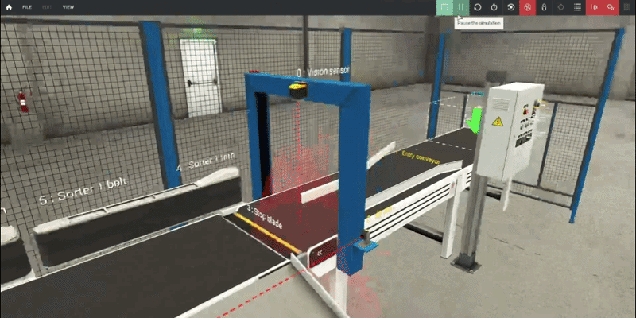
</p>

---

## Table of Contents

- [Automated Sorting Factory \& Robotic Machining Cell](#automated-sorting-factory--robotic-machining-cell)
  - [Live Simulation Demo](#-live-simulation-demo)
  - [Table of Contents](#-table-of-contents)
  - [1. Project Overview](#1-project-overview)
  - [2. System Architecture \& Data Communication](#2-system-architecture--data-communication)
    - [Communication Data Flow](#communication-data-flow)
  - [3. Plant Layout \& Station Breakdown](#3-plant-layout--station-breakdown)
    - [Plant Layout Schematic](#plant-layout-schematic)
    - [3D Virtual Plant Layout](#3d-virtual-plant-layout)
    - [Station 1: Infeed \& Color Vision Inspection](#station-1-infeed--color-vision-inspection)
    - [Station 2: Directional Diverter \& Sorter Junction](#station-2-directional-diverter--sorter-junction)
    - [Station 3: Robotic Manufacturing Cells (CNC Machining)](#station-3-robotic-manufacturing-cells-cnc-machining)
    - [Station 4: Outfeed Discharge \& Pallet Staging](#station-4-outfeed-discharge--pallet-staging)
  - [4. PLC Control Strategy \& Ladder Logic](#4-plc-control-strategy--ladder-logic)
    - [I/O Signal Mapping](#io-signal-mapping)
    - [Ladder Logic Breakdown](#ladder-logic-breakdown)
      - [A. Vision Sensor Value Comparison (Rung 35)](#a-vision-sensor-value-comparison-rung-35)
      - [B. Sorter Routing \& Timing Control (Rung 49–67)](#b-sorter-routing--timing-control-rung-4967)
      - [C. Robotic Cell Handshake (Rung 87–90)](#c-robotic-cell-handshake-rung-8790)
      - [D. Pallet Station Staging \& Stop (Rung 98–100)](#d-pallet-station-staging--stop-rung-98100)
  - [5. Engineering Challenges \& Solutions (OPC Latency Tuning)](#5-engineering-challenges--solutions-opc-latency-tuning)
    - [The Problem: Signal Latency / Missed Triggers](#the-problem-signal-latency--missed-triggers)
    - [Root Cause Analysis](#root-cause-analysis)
    - [The Solution: Simulation Time Scaling (0.5x)](#the-solution-simulation-time-scaling-05x)
  - [6. Repository Structure](#6-repository-structure)
  - [7. Getting Started \& Simulation Setup](#7-getting-started--simulation-setup)
    - [Prerequisites](#prerequisites)
    - [Step-by-Step Execution Guide](#step-by-step-execution-guide)
  - [8. Authors \& Academic Credits](#8-authors--academic-credits)

---

## 1. Project Overview

The primary objective of this project is to model, program, and commission a multi-stage industrial material handling and manufacturing cell:

1. **Color Discrimination**: Identify incoming raw workpieces based on optical color inspection (**Blue** vs. **Green**).
2. **Automated Sorting & Routing**: Divert workpieces using motorized pivot sorters and belt diverters to their respective manufacturing lines.
3. **Robotic Machine Tending**: Industrial 6-axis articulated robots with vacuum suction cups load, unload, and supervise CNC milling machines.
4. **Finished Product Palletizing**: Transport finished parts along discharge conveyors onto designated pallet storage staging areas.
5. **Fail-Safe & Emergency Handling**: Hardware emergency stop, line stop/start push buttons, and reset routines implemented via PLC ladder logic.

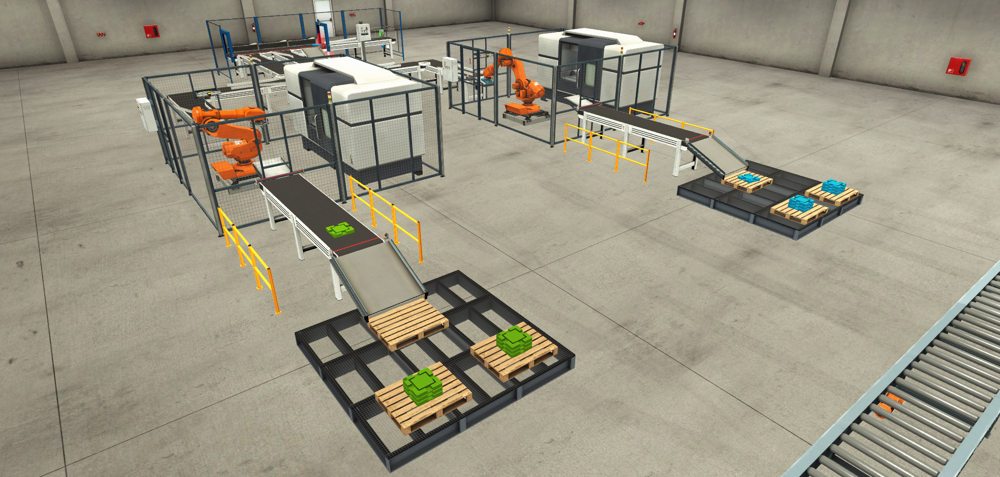

---

## 2. System Architecture & Data Communication

The digital twin architecture bridges virtual 3D physics with real industrial automation software via **OPC Data Access (OPC DA)**.

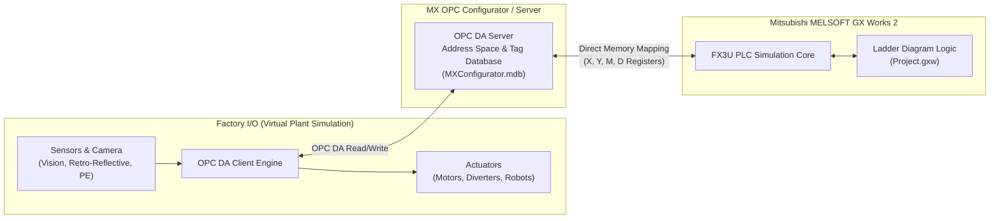

### Communication Data Flow

- **Factory I/O to PLC**: Virtual optical and proximity sensors write their state to OPC tags, mapped directly to Mitsubishi input registers (`X000`–`X011`) and data registers (`D1`/`D10`).
- **PLC to Factory I/O**: The ladder program executes its scan cycle and writes output coil states (`Y000`–`Y022`) through the OPC Server back to Factory I/O actuators.

---

## 3. Plant Layout & Station Breakdown

### Plant Layout Schematic

The material flow begins at the input material conveyor, passes through inspection and bilateral sorting, and splits into two symmetrical machining lines:

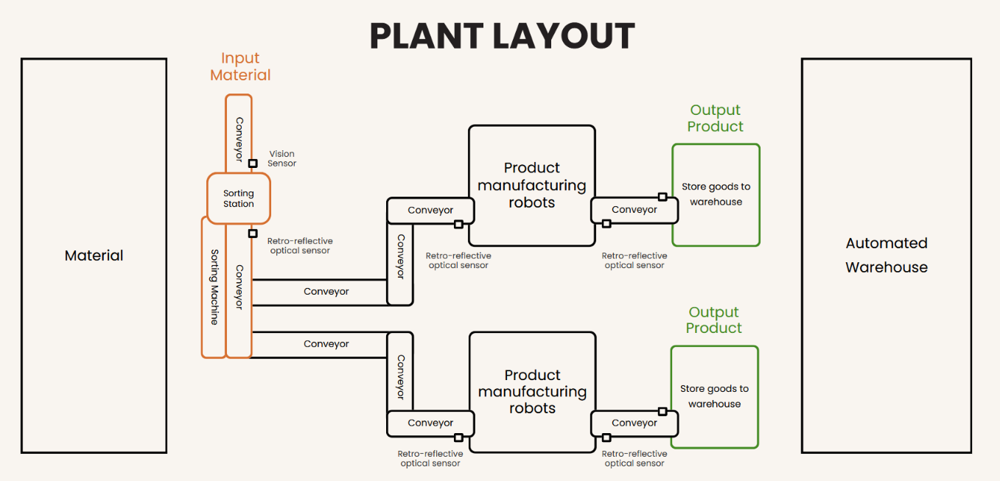

### 3D Virtual Plant Layout

An annotated isometric view of the operational stations in Factory I/O:

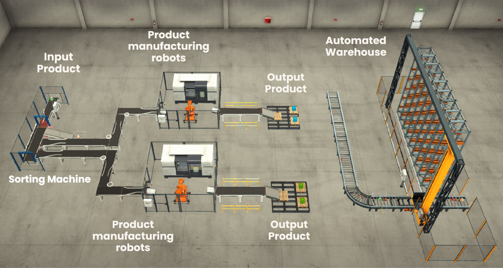

---

### Station 1: Infeed & Color Vision Inspection

Raw parts enter the system on the main entry conveyor (`Y000`). As each workpiece enters the inspection arch, it is detected by optical sensors and inspected by a high-resolution industrial **Vision Sensor**.

| Component                   | Function                                            | Tag / PLC Address |
| :-------------------------- | :-------------------------------------------------- | :---------------- |
| **Entry Conveyor**          | Transports raw material into the inspection tunnel  | `Y000`            |
| **Vision Sensor**           | Measures workpiece color code (1 = Blue, 4 = Green) | `D1` / `D10`      |
| **Retro-Reflective Sensor** | Confirms part presence inside the inspection zone   | Optical Sensor    |

<p align="center">
  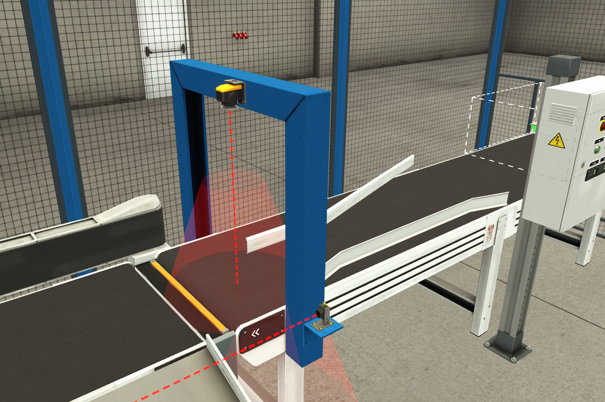
  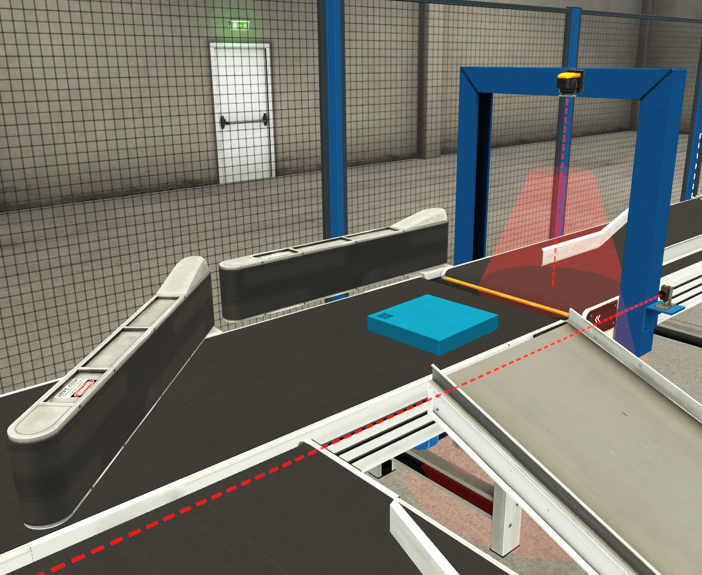
</p>

---

### Station 2: Directional Diverter & Sorter Junction

Once the workpiece color is evaluated, the part advances to the sorting transfer table:

- **Green Part (`M11`)**: Triggers the Green Sorter Belt (`Y004`) and rotates the Green Turning Blade (`Y005`) for 1.0 second.
- **Blue Part (`M10`)**: Triggers the Blue Sorter Belt (`Y006`) and rotates the Blue Turning Blade (`Y007`) for 1.0 second.
- **Retro-Reflective Optical Sensor (`X002`)**: Sits right at the sorting junction exit. Its beam interruption precisely synchronizes the turn blades with the part arrival.

<p align="center">
  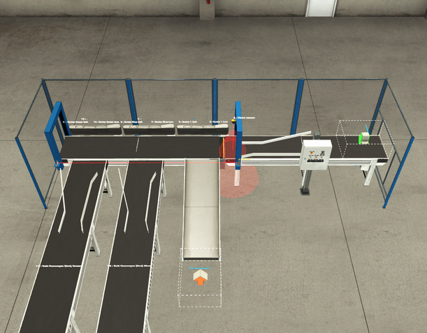
  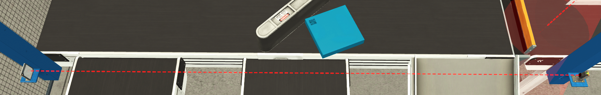
</p>

---

### Station 3: Robotic Manufacturing Cells (CNC Machining)

Each sorted line feeds into a dedicated manufacturing cell containing an articulated industrial robot and a CNC machining center:

- **Green Machining Cell**: Conveyors `Y002`, `Y011`, `Y012` advance the green workpiece until it hits arrival sensor `X003`. The robot (`Y015`) picks up the workpiece using a pneumatic vacuum gripper, loads it into the CNC milling machine, and unloads it upon cycle completion.
- **Blue Machining Cell**: Conveyors `Y003`, `Y013`, `Y014` advance the blue workpiece until it hits arrival sensor `X004`. The robot (`Y016`) picks and tends the CNC machine.

<p align="center">
  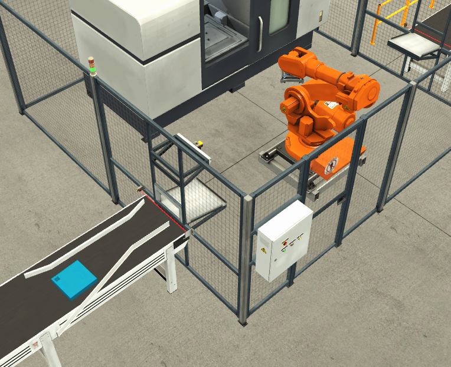
  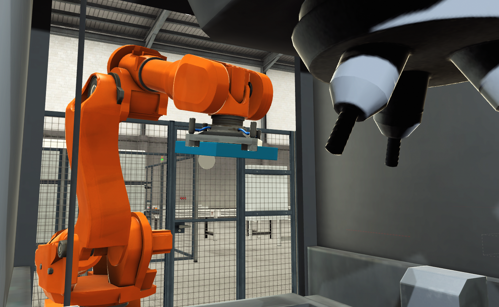
</p>

---

### Station 4: Outfeed Discharge & Pallet Staging

Following CNC processing, the robot transfers finished components onto the output discharge conveyor:

- Finished parts travel down an inclined roller chute and are stacked onto wooden pallets.
- Retro-reflective sensors (`X007` for Green, `X010` for Blue) detect when a part has landed on the pallet stop, resetting the output conveyor motor (`Y021`/`Y022`) to prevent jams.
- The staged pallets are positioned for retrieval by the Automated Warehouse storage crane.

<p align="center">
  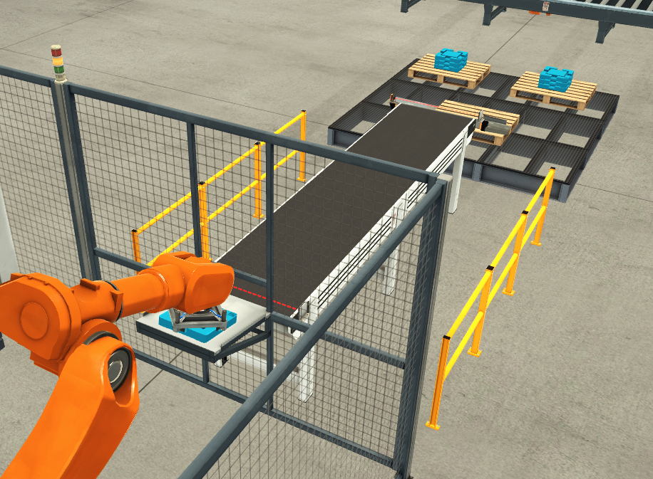
  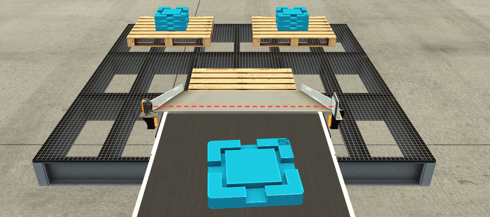
</p>

---

## 4. PLC Control Strategy & Ladder Logic

The PLC program is built with Mitsubishi **MELSOFT GX Works 2** using Ladder Diagram (LD) architecture designed for deterministic execution.

### I/O Signal Mapping

| Address       | Type     | Name                           | Description                                   |
| :------------ | :------- | :----------------------------- | :-------------------------------------------- |
| `X000`        | Input    | **Stop PB**                    | Normally-Closed line stop pushbutton          |
| `X001`        | Input    | **Start PB**                   | Normally-Open line start pushbutton           |
| `X002`        | Input    | **At Exit Sensor**             | Optical sensor at sorting diverter gate       |
| `X003`        | Input    | **Detect Green Arrived**       | Part arrival sensor at Green Robot infeed     |
| `X004`        | Input    | **Detect Blue Arrived**        | Part arrival sensor at Blue Robot infeed      |
| `X007`        | Input    | **Stop Conveyor Output Green** | Sensor at Green pallet station                |
| `X010`        | Input    | **Stop Conveyor Output Blue**  | Sensor at Blue pallet station                 |
| `X011`        | Input    | **Emer Stop**                  | Emergency Stop pushbutton (Hard safety line)  |
| `D1` / `D10`  | Register | **Vision Sensor Value**        | Numeric color value (`1` = Blue, `4` = Green) |
| `Y000`        | Output   | **Entry Conveyor**             | Main infeed belt motor                        |
| `Y001`        | Output   | **Exit Conveyor**              | Sorter base conveyor motor                    |
| `Y002`        | Output   | **Green Conveyor**             | Green branch main feeder conveyor             |
| `Y003`        | Output   | **Blue Conveyor**              | Blue branch main feeder conveyor              |
| `Y004`        | Output   | **Sorter Green Belt**          | Diverter belt drive for green parts           |
| `Y005`        | Output   | **Sorter Green Turn**          | Pivot blade actuator for green parts          |
| `Y006`        | Output   | **Sorter Blue Belt**           | Diverter belt drive for blue parts            |
| `Y007`        | Output   | **Sorter Blue Turn**           | Pivot blade actuator for blue parts           |
| `Y010`        | Output   | **Stop Blade**                 | Diverter gate safety stop blade               |
| `Y011`–`Y012` | Output   | **Green Conveyor 1 & 2**       | Green robot cell infeed sections              |
| `Y013`–`Y014` | Output   | **Blue Conveyor 1 & 2**        | Blue robot cell infeed sections               |
| `Y015`        | Output   | **Start Robot Green**          | Trigger green robot machining cycle           |
| `Y016`        | Output   | **Start Robot Blue**           | Trigger blue robot machining cycle            |
| `Y017`        | Output   | **Stop Robot Green**           | Reset / stop signal for green robot           |
| `Y020`        | Output   | **Stop Robot Blue**            | Reset / stop signal for blue robot            |
| `Y021`        | Output   | **Output Conveyor Green**      | Green pallet discharge conveyor               |
| `Y022`        | Output   | **Output Conveyer Blue**       | Blue pallet discharge conveyor                |
| `M0`–`M2`     | Internal | **CMP Status Flags**           | Flags output from `CMP K1 D1 M0`              |
| `M10`         | Internal | **Blue Workpiece Flag**        | Set when Blue part is confirmed               |
| `M11`         | Internal | **Green Workpiece Flag**       | Set when Green part is confirmed              |
| `M20`         | Internal | **Stop Blade Register**        | Interlock memory bit for diverter position    |
| `T0` / `T1`   | Timer    | **Sorter Timers**              | 1.0s (`K10`) duration timer for turn blades   |

---

### Ladder Logic Breakdown

#### A. Vision Sensor Value Comparison (Rung 35)

When the vision enable coil `M200` triggers, the PLC compares the integer output in data register `D1` against constant `K1` using the `CMP` instruction:

```text
[CMP K1 D1 M0]
- If D1 == K1 (Blue): Flag M1 is energized  -->  [SET M10]
- If D1 != K1 (Green): Flag M2 is energized -->  [SET M11]
```

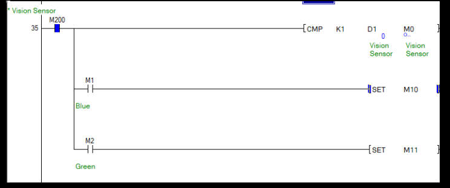

#### B. Sorter Routing & Timing Control (Rung 49–67)

When a workpiece triggers the exit sensor `X002`:

- If `M10` (Blue) is active, output coils `Y006` (Sorter Blue Belt) and `Y007` (Sorter Blue Turn) are set, while resetting conflicting green state `M11`. Timer `T0` counts for `K10` (1.0 second).
- When `T0` elapses, internal register `M20` is asserted to cycle the blade back.
- Identical symmetrical logic controls `Y004` and `Y005` when `M11` (Green) is active.

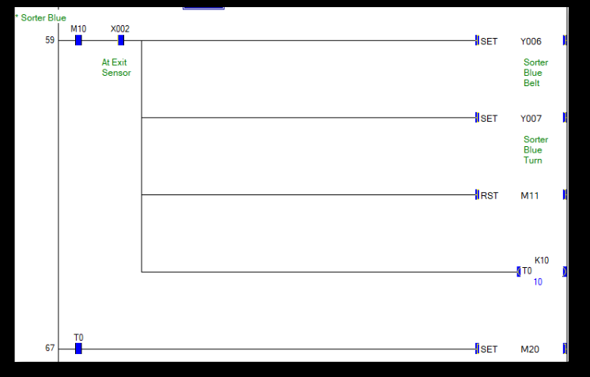

#### C. Robotic Cell Handshake (Rung 87–90)

When sensor `X003` (Detect Green Arrived) transitions HIGH:

- `[SET Y015]` starts the Green Manufacturing Robot cycle.
- `[RST Y017]` clears the robot stop condition.
- Similarly, sensor `X004` sets `Y016` for the Blue Robot.

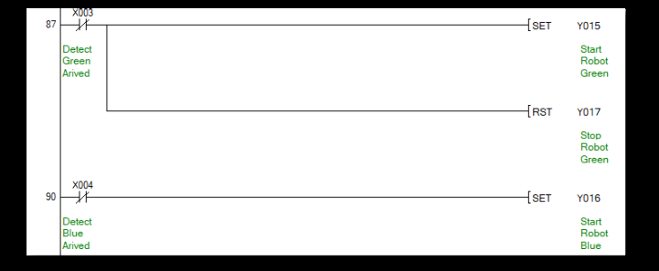

#### D. Pallet Station Staging & Stop (Rung 98–100)

When a part slides onto the pallet roller platform:

- Optical sensors `X007` and `X010` transition HIGH.
- The PLC immediately executes `[RST Y021]` and `[RST Y022]` to stop the outfeed conveyor, ensuring parts do not crash or tumble off the pallet.

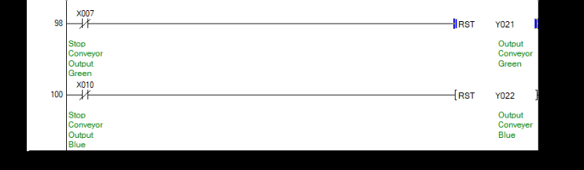

> [!NOTE]
> The full compiled PLC ladder program is available under [`src/gx-works2/Project.gxw`](file:///c:/Users/Legion5/Zteelers/Photos/Works/3%20Term%202/IE326%20-%20Automation%20Lab/Project/plc-factoryio-sorting-station/src/gx-works2/Project.gxw) and the official printable document is located at [`src/gx-works2/exports/ladder_diagram.pdf`](file:///c:/Users/Legion5/Zteelers/Photos/Works/3%20Term%202/IE326%20-%20Automation%20Lab/Project/plc-factoryio-sorting-station/src/gx-works2/exports/ladder_diagram.pdf).

---

## 5. Engineering Challenges & Solutions (OPC Latency Tuning)

### The Problem: Signal Latency / Missed Triggers

During initial testing at standard simulation speed (1.0x real-time), workpieces occasionally slipped past sorting diverters without activating the turn blades, leading to misdirection or line jams.

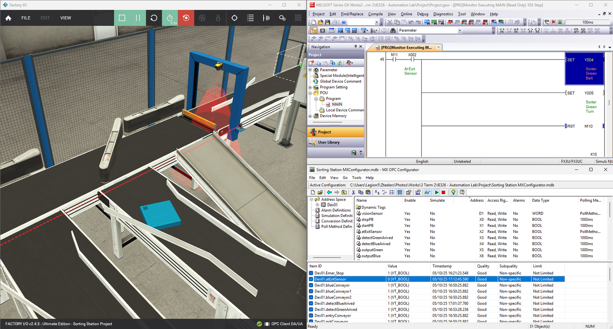

### Root Cause Analysis

Communication traversed a multi-hop middleware loop:
$$\text{Factory I/O (Physics)} \xrightarrow{\text{OPC DA Client}} \text{MX OPC Server} \xrightarrow{\text{Shared Memory / Socket}} \text{GX Works 2 Simulator}$$

1. The retro-reflective sensor (`atExitSensor` -> `X002`) outputs a narrow beam pulse as the small workpiece travels across at nominal belt speed (~0.7 m/s).
2. The OPC DA polling cycle and Windows thread context switching introduced **20–50 ms jitter**.
3. Consequently, the workpiece physically bypassed the sensor before the `X002` HIGH state was registered and evaluated in the GX Works 2 ladder scan, resulting in missed diverter triggers.

### The Solution: Simulation Time Scaling (0.5x)

To ensure reliable, deterministic operation without altering physical conveyor layouts:

1. **Time Scaling**: The Factory I/O physics engine time scale was configured to **`0.5x`**.
2. **Effective Polling Window**: Slowing the physics simulation by 50% doubled the effective contact duration of workpieces over sensors relative to the OPC update rate.
3. **Timer Compensation**: Timers `T0` and `T1` were tuned to `K10` (1.0 second), guaranteeing that diverter arms stay deployed long enough to complete mechanical transfer into the branch conveyors.

> [!TIP]
> For hardware-in-the-loop (HIL) setups with physical PLC hardware, connect directly via Ethernet (MC Protocol / Modbus TCP) to bypass OPC polling latency and achieve true sub-10ms scan response times.

---

## 6. Repository Structure

```plaintext
plc-factoryio-sorting-station/
├── docs/
│   └── Sorting_Factory_Presentation.pdf   # Academic project presentation slides
├── factory-io/
│   └── sorting_plant_scene.factoryio      # Factory I/O 3D digital-twin scene file
├── media/                                 # Visual assets, layout diagrams, and demo GIF
│   ├── sorting-plant-demo.gif             # Animated simulation demo
│   ├── plant-layout-diagram.png           # 2D schematic material flow layout
│   ├── plant-3d-overview.png              # Annotated 3D station overview
│   ├── factory-complete-overview.png      # High-resolution rendering of complete plant
│   ├── infeed-gantry-sensors.png          # Vision sensor gantry & inspection tunnel
│   ├── vision-sensor-sorting.png          # Vision sensor detection screenshot
│   ├── retro-reflective-beam-path.png     # Optical retro-reflective sensor beam path
│   ├── manufacturing-robot-station.png    # Articulated robot & CNC milling enclosure
│   ├── robot-vacuum-gripper.png           # Close-up of vacuum suction end-effector
│   ├── robot-output-transfer.png          # Robot discharge to pallet conveyor
│   ├── storage-pallet-loading.png         # Pallet staging and inclined chute
│   ├── opc-timing-troubleshooting.png     # OPC latency diagnostic side-by-side
│   ├── ladder-vision-compare.png          # Ladder logic: CMP instruction
│   ├── ladder-diverter-routing.png        # Ladder logic: Sorter diverter control
│   ├── ladder-robot-control.png           # Ladder logic: Robot start/stop trigger
│   └── ladder-output-conveyor.png         # Ladder logic: Outfeed conveyor control
├── src/
│   ├── gx-works2/                         # PLC Ladder project files
│   │   ├── Project.gxw                    # Mitsubishi GX Works 2 project file
│   │   └── exports/
│   │       └── ladder_diagram.pdf         # Printable complete ladder diagram schematic
│   └── opc-config/
│       └── MXConfigurator.mdb             # MX OPC Configurator database & tag definitions
└── README.md                              # Project documentation
```

---

## 7. Getting Started & Simulation Setup

### Prerequisites

- **Operating System**: Windows 10 / 11 (64-bit)
- **Virtual Simulation**: [Factory I/O](https://factoryio.com/) (v2.4.3 or newer)
- **PLC Software**: Mitsubishi [MELSOFT GX Works 2](https://www.mitsubishielectric.com/) (v1.500 or newer)
- **OPC Server**: Mitsubishi [MX Component](https://www.mitsubishielectric.com/) & [MX OPC Configurator / Server](https://www.mitsubishielectric.com/)

### Step-by-Step Execution Guide

#### Step 1: Configure MX OPC Server

1. Launch **MX OPC Configurator**.
2. Open configuration file [`src/opc-config/MXConfigurator.mdb`](file:///c:/Users/Legion5/Zteelers/Photos/Works/3%20Term%202/IE326%20-%20Automation%20Lab/Project/plc-factoryio-sorting-station/src/opc-config/MXConfigurator.mdb).
3. Verify that device address mappings (`X0`–`X11`, `Y0`–`Y22`, `D1`) correctly match the active GX Simulator FX3U station.
4. Save and start the OPC Server runtime service.

#### Step 2: Launch PLC Simulation in GX Works 2

1. Open [`src/gx-works2/Project.gxw`](file:///c:/Users/Legion5/Zteelers/Photos/Works/3%20Term%202/IE326%20-%20Automation%20Lab/Project/plc-factoryio-sorting-station/src/gx-works2/Project.gxw) in **GX Works 2**.
2. Navigate to **Online** > **Start/Stop Simulation** (GX Simulator 2).
3. Switch the virtual PLC to **RUN** mode.
4. Open the Ladder Monitor (`[PRG]Monitor Executing MAIN`) to observe real-time rung execution.

#### Step 3: Connect and Run Factory I/O

1. Open [`factory-io/sorting_plant_scene.factoryio`](file:///c:/Users/Legion5/Zteelers/Photos/Works/3%20Term%202/IE326%20-%20Automation%20Lab/Project/plc-factoryio-sorting-station/factory-io/sorting_plant_scene.factoryio) in **Factory I/O**.
2. Go to **File** > **Drivers** > select **OPC Client DA/UA**.
3. Under Configuration:
   - Server: Select **Mitsubishi.MXOPC.1**
   - Click **Connect** (a green checkmark indicates a successful link).
4. Return to the 3D scene.
5. Set simulation time scale to **`0.5x`** (recommended for deterministic signal handshake).
6. Click the **Play** button in the Factory I/O top toolbar.

#### Step 4: System Operation

- Press the green **Start PB** on the physical control panel to power on conveyors.
- Workpieces will generate, pass through color vision inspection, route to the respective robot machining station, and discharge onto pallets.
- Press **Stop PB** for controlled line pause or **Emergency Stop** for immediate shutdown.
